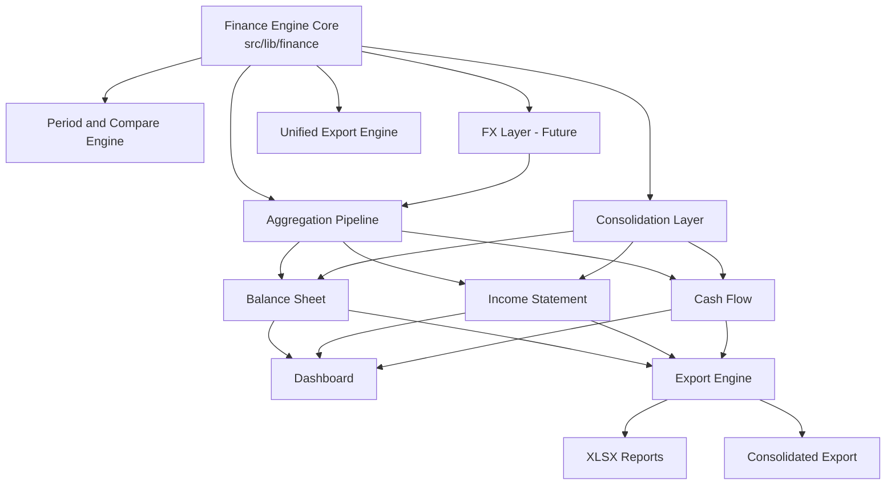

# Finance Dashboard – Master Execution Roadmap (Governance V2)

> Internal Strategic Execution Document  
> Authoritative operational plan for architecture, finance engine, reporting, export, consolidation and automation.
> This file lives in the private repo and is mirrored to the public docs repo.
> Items are removed ONLY after full phase completion + validation.

Last Updated: 2026-02-21

---

# STATUS LEGEND

- 🟢 Completed
- 🟡 In Progress
- 🔵 Planned
- 🔴 Blocked
- ⚫ On Hold

---

# CHANGE LOG (MANDATORY)

| Date | PR | Area | Phase | Summary |
|------|----|------|-------|---------|
| 2026-02-20 | #73 | Balance Sheet Unification | 0/Phase 1 | Remove legacy balance-sheet endpoint; migrate dashboard to report model; add guardrail; align docs. |
| 2026-02-20 | #74 | Balance Sheet Unification | Phase 1 | Remove BalanceSheetResponse legacy type; align API/public types and docs. |
| 2026-02-20 | #75 | Governance | N/A | Move MASTER_EXECUTION_ROADMAP under docs/ for public mirror. |
| 2026-02-20 | #78 | Governance / Guardrails | N/A | Add CI-safe guardrail enforcing Change Log updates for finance-critical changes. |
| 2026-02-21 | #TBD | Unified Export Engine | Phase 5 | Add unified /api/finance/export orchestration, route unification for single-report exports, and structural invariant tests for ordering/parity. |
| 2026-02-21 | #TBD | Full Financial Unification (A) | Phase 4 (Dashboard Alignment) | Remove duplicate dashboard totals logic; centralize P&L + budget totals helpers in src/lib/finance; add tests to prevent drift. |
| 2026-02-21 | #87 | Full Financial Unification (A) | Phase 2 (Aggregation Convergence) | Budget vs Actual: move variance and variance% computation into finance model layer; UI is now render-only (no behavior change). |
| 2026-02-21 | #TBD | Full Financial Unification (A) | Phase 2 (Aggregation Convergence) | Document Financial Aggregation Architecture and define single-entry aggregation target model. |
| 2026-02-21 | #TBD | Full Financial Unification (A) | Phase 2 (Aggregation Convergence) | Unify period + compare resolution via single canonical entrypoint; add guardrail. |
| 2026-02-21 | #TBD | Full Financial Unification (A) / Phase 2–4 Convergence | Phase 2–4 | Documented amended Phase 2 plan: dedup helpers, totals agreement guardrail, dashboard server alignment, cache invalidation, nondeterminism cleanup; added future-proof AI insights + import pipeline architecture docs. |
| 2026-02-21 | #TBD | Governance / Architecture | N/A | Added AI Insights Architecture + Import Pipeline Architecture docs; added Future Claude Recommendations doc. |
| 2026-02-21 | #TBD | Full Financial Unification (A) | Phase 2 (Aggregation Convergence) | Deduplicate zeroMonths to canonical src/lib/finance/months.ts; remove duplicate implementations across finance modules and contract registry. |
| 2026-02-21 | #TBD | Full Financial Unification (A) | Phase 2 (Aggregation Convergence) | Canonicalize filterBudgetByScope into budget-scope helper; add contract tests to prevent drift. |

Every merged PR MUST:
1. Map to a section below
2. Update phase progress
3. Be logged here

---

# MASTER ARCHITECTURE DEPENDENCY GRAPH

---

# EXECUTION ORDER (STRICT)

1. Balance Sheet Unification  
2. Aggregation Convergence  
3. Cash Flow Structural Stabilization  
4. Dashboard Alignment  
5. Unified Export Engine  
6. Consolidation Layer  
7. FX Layer  
8. Engine Extractability  

No skipping order without explicit architectural review.

---

## Execution Model Clarification

The Full Financial Unification Program follows an Iterative Convergence Model.
Later phases MAY begin before earlier phases are fully closed.
Completion is defined by architectural invariants and production behavior, not strict linear checkbox order.
Sequence remains a planning default, not a hard blocker when convergence work overlaps phases.
Architectural correctness and deterministic outputs take priority over linear progression.

---

# 0️⃣ FULL FINANCIAL UNIFICATION PROGRAM
Status: 🟡 In Progress

## Objective
Single unified finance model powering:
- Income Statement
- Balance Sheet
- Cash Flow
- Dashboard
- XLSX Export
- Future external service extraction

---

## Phase 1 – Balance Sheet Unification 🟢 Completed
- [x] Introduced BalanceSheetReportModel
- [x] Engine-driven report endpoint
- [x] Dashboard migration to report model
- [x] Remove legacy snapshot endpoint
- [x] Remove BalanceSheetResponse type
- [x] Remove getBalanceSheetModel from engine
- [x] Add legacy usage guardrail

Exit Criteria:
- Only one Balance Sheet model exists
- No `/api/finance/balance-sheet` usage
- All tests pass

---

## Phase 2 – Aggregation Convergence 🟡 In Progress
- [ ] Single aggregation entry point verified
- [x] Financial Aggregation Architecture documented
- [ ] Remove duplicate totals logic
- [x] Remove duplicate variance logic
- [x] Period selection unified
- [x] Budget vs Actual share same source
- [ ] Guardrail Enforcement Layer (prevent aggregation drift)
- [x] Deduplicate `filterBudgetByScope`
- [x] Deduplicate `zeroMonths` (single canonical import)
- [ ] Canonical revenue helper policy + implementation planned
- [ ] Cache invalidation on write endpoints
- [ ] Remove nondeterministic defaults from finance core
- [ ] Totals agreement guardrail
- [ ] Dashboard endpoint server alignment (Phase 2/4 coupling)
Notes:
- Convergence refactors are in progress, including helper centralization.
- Invariant-level verification is not yet complete.

Exit Criteria:
- Summary / Detailed / Departments identical totals source
- No drift across reports

---

## Phase 3 – Cash Flow Structural Alignment 🟡 In Progress
- [ ] Validate delta reconciliation vs Balance Sheet
- [ ] Ensure no snapshot dependency
- [ ] Add invariant reconciliation tests
- [ ] Remove redundant balance fetch

Exit Criteria:
- Cash Flow deterministically reconciles to Balance Sheet

---

## Phase 4 – Dashboard Alignment 🟡 In Progress
- [ ] Dashboard uses server-side `DashboardModel` only
- [ ] Dashboard UI consumes a single `/api/finance/dashboard` endpoint (no N+1)
- [ ] No finance logic in UI (render-only consumption)
- [ ] KPI logic centralized in src/lib/finance
- [ ] Compare logic remains identical to Income Statement
- [ ] Dashboard model composes from report models or unified aggregation output (no parallel totals path)
Notes:
- Dashboard totals helper unification is implemented.
- Full alignment invariants are not yet verified end-to-end.

Exit Criteria:
- Dashboard derived solely from unified engine output

---

## Definition of Completion

The Full Financial Unification Program is complete only when:
- A single aggregation pipeline is used across all financial reports.
- No duplicate totals or variance logic exists.
- Period resolution is globally unified.
- Cash Flow is structurally aligned with Balance Sheet movements.
- The Dashboard performs zero financial calculations.
- The Finance Engine can be extracted into a standalone service without refactor.

---

# 1️⃣ UNIFIED EXPORT ARCHITECTURE PROGRAM
Status: 🟡 In Progress (Phase 1–3 Complete)

## Objective
Single export engine shared by:
- Income Statement
- Balance Sheet
- Cash Flow
- Budget vs Actual
- Future Consolidated reports

---

## Phase 1 – DTO Alignment ✅ Completed
- [x] All exports are built from stable report models (no UI-derived DTOs)
- [x] Removed direct per-report ExcelJS construction
- [x] Compare column structure aligned across reports

---

## Phase 2 – Shared Export Builder ✅ Completed
- [x] Central builder in `src/lib/finance/export`
- [x] WorkbookDef registry implemented
- [x] Unified engine XLSX methods per report
- [x] Unified export route adapter pattern
- [x] Default year consistency across exports
- [x] No UI-level formatting logic

---

## Phase 2.5 – Export Surface Completion ✅ Completed
- [x] Multi-report export orchestration (single/multi/all reports in one workbook)
- [x] Filename convention alignment across reports
- [x] Preset strategy clarification:
      - Presets exist only for Budget vs Actual
      - Other reports are currently single-mode exports
      - Preset expansion will occur only if multiple export variants become necessary

---

## Phase 3 – Structural Invariants ✅ Completed
- [x] Snapshot workbook structure tests per report
- [x] Column order invariant enforcement
- [x] Compare mode parity validation (NONE / PREVIOUS_PERIOD / PRIOR_YEAR)

---

## Phase 4 – Styling Layer
- [ ] Column width normalization
- [ ] Header hierarchy formatting
- [ ] Percent formatting consistency
- [ ] Board-ready appearance

Exit Criteria:
- All reports export through a unified workbookDef → builder → buffer pipeline
- Export surface (single + multi) is stable
- Structural invariants enforced by automated tests

---

# 2️⃣ CONSOLIDATION PROGRAM (Multi-Entity)
Status: 🔵 Planned

## Objective
Support consolidated financial statements (IL + US / Multi-Entity).

---

## Phase 1 – Architectural Design
- [ ] Define consolidation scope
- [ ] Define elimination rules
- [ ] Define intercompany adjustments
- [ ] Define ownership % future extension
- [ ] ADR approval

---

## Phase 2 – Engine-Level Consolidation
- [ ] Implement consolidation aggregator
- [ ] Integrate elimination adjustments
- [ ] Ensure compare compatibility
- [ ] Preserve DTO structure

---

## Phase 3 – Reporting & Export
- [ ] Consolidated IS / BS / CF support
- [ ] Export identical structure to single entity
- [ ] Add consolidation metadata field

---

## Phase 4 – Guardrails
- [ ] Intercompany imbalance detection
- [ ] Consolidation invariant tests
- [ ] Cross-entity reconciliation tests

Exit Criteria:
- Consolidated financials deterministic and reconciled

---

# 3️⃣ FX (MULTI-CURRENCY) PROGRAM
Status: 🔵 Planned

## Objective
Support currency normalization and multi-currency reporting.

---

## Phase 1 – Design
- [ ] Base currency strategy
- [ ] FX rate storage model
- [ ] Historical conversion logic
- [ ] No double conversion guarantee

---

## Phase 2 – Engine Integration
- [ ] FX normalization layer
- [ ] Conversion before aggregation
- [ ] Remove USD assumptions

---

## Phase 3 – Reporting & Export
- [ ] Currency metadata
- [ ] FX export compatibility
- [ ] Validation tests

Exit Criteria:
- All reports consistent under FX mode

---

# 4️⃣ KPI SYSTEM REDESIGN
Status: 🔵 Planned

## Objective
Enterprise-grade KPI system aligned with unified engine.

---

## Phase 1 – KPI Contract
- [ ] Define KPI DTO
- [ ] Derived strictly from engine
- [ ] No UI calculations

---

## Phase 2 – Visual Redesign
- [ ] Modern card layout
- [ ] Compare alignment
- [ ] Period selector alignment

---

## Phase 3 – Validation
- [ ] Deterministic output tests
- [ ] Compare consistency tests

Exit Criteria:
- KPI logic isolated in finance layer

---

# 5️⃣ AUTOMATION & ARCHITECTURAL GUARDRAILS
Status: 🟡 In Progress

---

## Phase 1 – Contract Drift Protection
- [ ] Balance Sheet fixture protection
- [ ] Cash Flow fixture protection
- [ ] Export contract fixture tests

---

## Phase 2 – Legacy & Policy Guardrails
- [x] Forbid `/api/finance/balance-sheet`
- [x] No finance math in UI
- [ ] No Prisma in src/lib/finance
- [ ] No debug endpoints in production

---

## Phase 3 – CI Enforcement
- [ ] Enforce PR classification
- [ ] Enforce lint/test/build
- [ ] Prevent dev artifacts

---

## Phase 4 – DB & Aggregation Invariants
- [ ] Schema fingerprint test
- [ ] Aggregation consistency test
- [ ] Determinism snapshot test

Exit Criteria:
- Architectural drift impossible without CI failure

---

# 6️⃣ FINANCE ENGINE EXTRACTABILITY
Status: 🔵 Planned

---

## Phase 1 – Boundary Isolation
- [ ] IO isolated to server layer
- [ ] DTO separation
- [ ] No framework coupling

---

## Phase 2 – External Contract Definition
- [ ] Stable engine interface
- [ ] Integration simulation test

Exit Criteria:
- Engine portable as external service

---

# REMOVAL POLICY

A section may be removed only when:
1. All phases complete
2. Tests pass
3. Docs updated
4. No regression after merge
5. Logged in Change Log

Until then — it stays.
